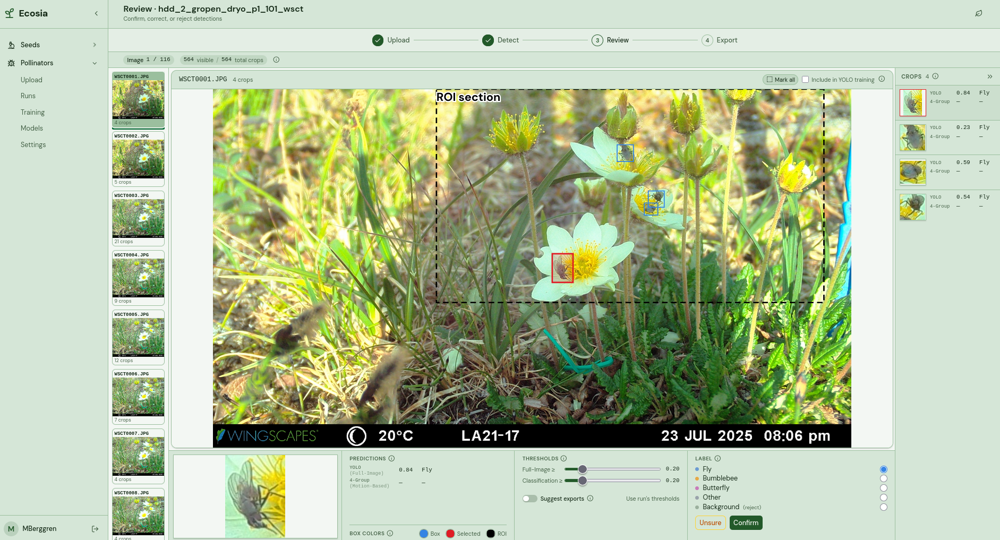
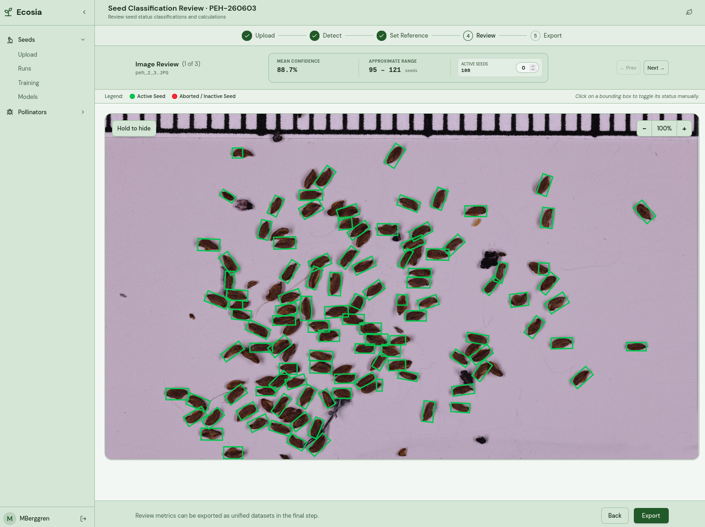

# Ecosia

Automated ecological image analysis. Machine learning for **seed counting** and
**pollinator detection**, with human review of every run and a retraining loop for
the pollinator model. Built with Django, Vue.js, and PyTorch.

## Table of Contents

- [Description](#description)
- [User Interface Examples](#user-interface-examples)
- [Installation](#installation)
- [Environment Settings](#environment-settings)
- [Architecture Design](#architecture-design)
- [Research and Model Development](#research-and-model-development)
- [Documentation](#documentation)

## Description

Ecosia turns field-camera frames and seed-tray imagery into reviewed, exportable data.
It runs two separate pipelines with different detection and training internals, even
where their review screens look alike:

| Module | Input | What it produces |
|--------|-------|------------------|
| **Pollinator** | Wildlife-camera frames | Pollinator detections, per-detection crops, a retrainable detector, annotated images |
| **Seed** | Close-focus camera shots of seeds (with a species label card) | Seed counts and confidence ranges, annotated images|

A reviewer corrects the model's detections in the browser. In the pollinator module, confirmed detections can be used as training data for the next model version, either in-app or through the Jupyter notebooks. The seed module does not retrain from reviewed results yet: new seed models are trained separately from imported labeled data.

## User Interface Examples

Click a row to expand the screenshot. More available screenshots of the UI at [images](docs/images/).

<details>
<summary><b>Pollinator review page</b>: relabel detections, tune thresholds, mark for training</summary>



</details>

<details>
<summary><b>Seed review page</b>: active vs. aborted seeds, live counts and confidence</summary>



</details>

## Installation

### Get the code

**With git:**

```bash
git clone https://github.com/m-berggren/automated-ecological-image-analysis.git
cd automated-ecological-image-analysis
```

**Without git (ZIP):** on the GitHub page click **Code ▸ Download ZIP**, unzip it,
and open a terminal in the extracted folder. This is the simplest route if you
just want to run the app (pair it with **Option A: Docker** below) and don't plan
to pull updates.

Pick one of the three paths below.

<details>
<summary><b>Option A: Docker</b> (full production-style stack)</summary>

> We are having issues running training and inference for macOS users with Docker. Current recommendation is to go with **Option B** in this case.

A three-service Compose stack: Postgres, the Django API on gunicorn, and nginx
serving the built Vue SPA while reverse-proxying `/api`, `/admin`, `/media`, and
`/static` to the backend. Single origin, so no CORS. Uses
`config.settings.production`.

```bash
cp .env.example .env          # then edit SECRET_KEY, SQL_PASSWORD, etc.
docker compose up --build -d  # detached, open http://localhost:8080
```

To start with the demo dataset preloaded instead of an empty app, set
`IMPORT_DEMO=true` in `.env` before bringing the stack up (see
[Demo data](#demo-data-optional) below).

The backend container runs migrations and `collectstatic` on startup, then the
app is ready at http://localhost:8080. Register an account from the sign-in page
to log in. With demo data enabled, a default `admin` / `admin123` account already
exists.

State persists in named volumes:

| Volume | Mount | Holds |
|--------|-------|-------|
| `postgres_data` | db `/var/lib/postgresql/data` | database |
| `media_data` | backend `/app/media` (nginx ro) | pollinator/analysis runs, crops, model files, training output |
| `data_store` | backend `/app/data` | seed module datasets, labels, weights |
| `static_data` | backend `/app/staticfiles` (nginx ro) | collected admin/DRF static |
| `model_cache` | backend `/app/.cache` | torch / EasyOCR / Ultralytics / cloud-model weights |

> **Storage grows unbounded.** A pollinator run of 10k images is roughly 16 GB of
> source images plus ~6 GB of crops, stored once under
> `media/runs/<module>/<run_id>/`. Nothing caps or auto-prunes this. The only
> reclaim is deleting a run (`DELETE /api/analysis/runs/<id>/`, which removes its
> images and crops). Size `media_data`'s host disk accordingly and prune old runs.

</details>

<details>
<summary><b>Option B: One-command dev script</b></summary>

Runs the Django API (`:8000`) and the Vite dev server (`:5173`) side by side, with
one Ctrl+C taking both down. On a clean machine it installs only what's missing
(mise -> uv + node -> Python 3.13) and uses anything already on `PATH`.

**macOS / Linux**: make the script executable once, then run it:

```bash
chmod +x scripts/dev.sh       # one-time: grant execute permission
./scripts/dev.sh
```

(Or skip `chmod` and run it through bash directly: `bash scripts/dev.sh`.)

**Windows (PowerShell)**: Windows blocks unsigned scripts by default, so run it
with an execution-policy bypass:

```powershell
powershell -ExecutionPolicy Bypass -File scripts\dev.ps1
```

</details>

<details>
<summary><b>Option C: Manual steps</b></summary>

Requires the two tools below, then four commands.

**Prerequisites**

- **uv** (Python package manager): `curl -LsSf https://astral.sh/uv/install.sh | sh`, or `pip install uv`, or `brew install uv`.
- **Node.js 24**: `mise install` (if you use [mise](https://mise.jdx.dev)), or [nodejs.org](https://nodejs.org), or `brew install node`.

```bash
uv sync                                   # Python dependencies
cd frontend && npm install && cd ..       # frontend dependencies
uv run python manage.py migrate           # database
```

Run the two servers in separate terminals:

```bash
uv run python manage.py runserver         # Django API on :8000
cd frontend && npm run dev                # Vue dev server (hot reload) on :5173
```

Open http://localhost:8000. The Vite server on `:5173` is only for isolated
frontend development with hot reload.

</details>

### Demo data (optional)

To start with real, browsable data instead of an empty app:

- **Docker:** set `IMPORT_DEMO=true` in `.env` before `docker compose up -d`. The
  entrypoint imports the demo dataset on first boot (idempotent, it no-ops once
  the demo runs exist). If no superuser exists, a default **`admin` / `admin123`**
  is created (override via the `DJANGO_SUPERUSER_*` env vars, change it for any
  non-local deployment).
- **Local (no Docker):** the import needs dependencies installed and migrations
  applied, which the dev script (Option B) sets up. Run it once, stop it with
  Ctrl+C, import the data, then start it again:

  ```bash
  uv run python manage.py import_demo   # add --reset to wipe demo data and reload
  ```

  Re-running `bash scripts/dev.sh` (or `scripts\dev.ps1`) brings the app back up
  with the demo data loaded.

On first boot the import downloads the demo bundle and model weights from the URLs
in [demo_assets/sources.json](demo_assets/sources.json), or uses a local
`demo_assets/demo_bundle.zip` if one is mounted. See
[demo_assets/README.md](demo_assets/README.md) for the full bundle workflow.

## Environment Settings

Docker reads configuration from `.env` (copy [.env.example](.env.example) and fill
in real values). The key variables:

| Variable | Purpose |
|----------|---------|
| `SECRET_KEY` | Django secret. Generate with `python -c "import secrets; print(secrets.token_urlsafe(64))"`. |
| `ALLOWED_HOSTS` | Comma-separated hosts Django will serve. |
| `CSRF_TRUSTED_ORIGINS` | Public origin(s) for the admin / browsable API (scheme + host + port). |
| `CORS_ALLOW_ALL` | Keep `false` for the same-origin nginx setup, `true` only for split-origin. |
| `SQL_*` | Database name, user, password, host, port (shared by Django and the Postgres container). |
| `IMPORT_DEMO` | `true` populates a fresh DB with the demo dataset on first boot. |
| `DJANGO_SUPERUSER_*` | Username / password / email for the admin created by the demo import. |
| `GUNICORN_WORKERS` / `THREADS` / `TIMEOUT` | Backend gunicorn tuning. |
| `WEB_PORT` | Host port nginx is published on (`http://localhost:${WEB_PORT}`, default 8080). |
| `VITE_API_BASE_URL` | Empty for same-origin (nginx proxy), a full URL for split-origin. |

Notes:

- torch / torchvision are pinned to the **CPU** wheels in `pyproject.toml`
  (`[tool.uv.sources]`), which keeps the image small and GPU-free. This also
  applies to a local `uv sync`. For local GPU work, point the `pytorch-cpu`
  index at a CUDA channel (e.g. `.../whl/cu124`) and re-lock.
- The container builds a standalone SPA (`BUILD_TARGET=standalone`). The default
  `npm run build` still emits the `static/vue` manifest for Django integration.

## Architecture Design

Three layers, each with a single responsibility:

| Layer | Location | Responsibility |
|-------|----------|----------------|
| Frontend | `frontend/` | Vue SPA. Upload, review, training, and results pages. Talks to the backend over the REST API only. |
| Backend | `apps/`, `config/` | Django + DRF. Owns the database, the REST API, and orchestration. Runs inference and training in background threads. |
| ML core | `ml_pipelines/` | Framework-agnostic PyTorch / YOLO code. No Django imports. Consumed by the backend at runtime and by the research notebooks. |

The backend never embeds model code, it imports `ml_pipelines` and drives it, so
the Django worker and the research notebooks run the same implementation. Both
modules upload images, run inference, and let a reviewer correct the results before
export. They diverge on training: the pollinator module can feed confirmed detections
back into a new model, while the seed module trains only from separately uploaded
labeled data. The per-app READMEs carry the structure and the detail:

- [apps/pollinator](apps/pollinator/README.md): crop-based inference, dual-detector merge, training pool.
- [apps/seeds](apps/seeds/README.md): SAHI tiled YOLO-OBB inference, reference-seed active/aborted filtering, per-species training.
- [apps/analysis](apps/analysis/README.md): the shared models (`Detection`, `InferenceRun`, `ModelVersion`, `TrainingJob`), runs, and training lifecycle.

### Diagrams (PDF)

- [Pollinator system diagram](docs/diagrams/pollinator-system-diagram.pdf)
- [Pollinator flow diagram](docs/diagrams/pollinator-flow-diagram.pdf)
- [Seed system diagram](docs/diagrams/seed-system-diagram.pdf)
- [Seed training flow](docs/diagrams/seed-flow-training.pdf)

## Research and Model Development

The trained models and the demo dataset are archived on Zenodo and citable by DOI:

> **DOI: [10.5281/zenodo.20492661](https://doi.org/10.5281/zenodo.20492661)**

The record holds every model weight the app ships with (four per-species seed
YOLO-OBB detectors, the pollinator binary and group classifiers, and the
pollinator YOLO detector) alongside the demo bundle. The exact files and checksums
the importer downloads are listed in
[demo_assets/sources.json](demo_assets/sources.json) (see
[demo_assets/README.md](demo_assets/README.md)).

For future developers extending or retraining the models, the research notebooks
live under `ml_pipelines/notebooks/`. The pollinator work is the most developed,
covering two parallel pipelines (crop-based classifiers and a YOLO detector) plus
training, evaluation, and sensitivity-analysis notebooks.

| Area | Doc |
|------|-----|
| Pollinator model development (overview + common tasks) | [ml_pipelines/notebooks/pollinator_detection/README.md](ml_pipelines/notebooks/pollinator_detection/README.md) |
| Pollinator full technical reference (data flow, training vs. retraining, Colab setup) | [ml_pipelines/notebooks/pollinator_detection/PIPELINE.md](ml_pipelines/notebooks/pollinator_detection/PIPELINE.md) |
| Seed-counting prototypes (now refactored into `seed_src/`) | [ml_pipelines/notebooks/seed-counting/README.md](ml_pipelines/notebooks/seed-counting/README.md) |

## Documentation

### Per-area READMEs

| Area | Doc |
|------|-----|
| ML core overview | [ml_pipelines/README.md](ml_pipelines/README.md) |
| Pollinator pipeline (backend-consumed library) | [ml_pipelines/pollinator/README.md](ml_pipelines/pollinator/README.md) |
| Seed pipeline | [ml_pipelines/seed_src/README.md](ml_pipelines/seed_src/README.md) |
| Frontend | [frontend/README.md](frontend/README.md) |
| Backend apps overview | [apps/README.md](apps/README.md) |
| Backend core (Detection, runs, training) | [apps/analysis/README.md](apps/analysis/README.md) |
| Backend pollinator module | [apps/pollinator/README.md](apps/pollinator/README.md) |
| Backend seeds module | [apps/seeds/README.md](apps/seeds/README.md) |
| Demo bundle (export/import workflow) | [demo_assets/README.md](demo_assets/README.md) |

### User manuals (PDF)

| Workflow | Manual |
|----------|--------|
| Pollinator inference run | [manual-pollinator-inference-run.pdf](docs/manuals/manual-pollinator-inference-run.pdf) |
| Pollinator training | [manual-pollinator-training.pdf](docs/manuals/manual-pollinator-training.pdf) |
| Seed inference run | [manual-seed-inference-run.pdf](docs/manuals/manual-seed-inference-run.pdf) |
| Seed training | [manual-seed-training.pdf](docs/manuals/manual-seed-training.pdf) |
